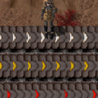

# Crude Transport Belt

A mod for [Factorio](https://factorio.com/). 

Adds the *Crude Transport Belt*, a tier below the normal Transport Belt. This is a very cheap but slow transport belt to allow easier early automation and item transportation.

The speed is 1/3 of the normal Transport Belt, which is 5 items/s. The exact crafting cost and amount of crafted items is configurable, so you can adjust it to be cheap or even expensive, or adjust it to fit in with costs of other mods you might have.

## Installation

While the source is provided here, for actual use just use the [official Factorio mod portal](https://mods.factorio.com/mod/crude-transport-belt) to download and install the mod (or just do so from inside the game).

## Features

- Adds 1 new transport belt, the Crude transport belt, a tier below the normal Transport belt 
- Recolored transport belt with "white" markings
- Working remnants when destroyed
- No technology required to unlock, it is available immediately just like the normal Transport belt
- Upgrade planner will replace it with normal Transport belts
- Choose from 2 crafting recipes, you can enable just one or both
- Adjust all crafting costs and craft amounts using the mod settings 
- No new underground or splitter variant, it's just about the belt

## Why does this mod exist? Does anyone want a slower belt?

Well this is basically for me. Firstly, I wanted to get into Factorio modding and wanted to pick something simple to learn some basics. 

Second, I actually want cheap slow belts. I always get annoyed at the beginning of a playthrough not being able to quickly set up some basic belts. It just helps me see things properly to have all the belts setup. But even the normal Transport Belt is expensive in the beginning, all things considered.

So just to have some belts placed, I wanted something like this.

## The Crude transport belt

The Crude transport belt is intended as a slower and worse version of the normal Transport belt, but it should also be much cheaper to craft.

Compared to Transport belt in brackets:
- **Health: 50 (150)**
- Resistances: Fire 50% (90%)
- Belt speed: 5 items/s (15 items/s)

### Crafting Recipes

You can choose one or both of the crafting recipes:
- Only Iron Plate 
- Iron Plate and Gear

#### Only Iron Plate

This recipe is enabled by default and will allow you to craft Crude transport belts for just Iron plates.

By default the cost is 1 Iron plate and crafts 4 belts. But the values can be adjusted to your liking.

Compared to that the Transport belt costs 1 Iron gear wheel and 1 Iron plate which equals 3 Iron plates total and crafts 2 belts.

#### Iron Plate and Gear

This recipe is disabled by default and will allow you to craft Crude transport belts for Iron gear wheels and Iron plates, so the same base recipe as the normal Transport belt.

By default the cost is 1 Iron gear wheel and 1 Iron plate which equals 3 Iron plates total and crafts 4 belts. But the values can be adjusted to your liking.

Compared to that the Transport belt costs 1 Iron gear wheel and 1 Iron plate which equals 3 Iron plates total and crafts 2 belts.

### Mod Settings

The mod settings allow you to:
- Enable or disable both of the crafting recipes
- Change the multiplier for crafting costs (the base value is 1 Iron plate and 1 Iron gear wheel for both recipes, and is then multiplied by the setting value), default multiplier is 1
- Change the multiplier for crafted amount of belts (the base value is 1 belt for both recipes, and is then multiplied by the setting value), default multiplier is 4

## Compatibility

Should be compatible with just about every other mod, as it just adds a new simple belt. 

Maybe it could be incompatible with certain mods that change the existing Transport belts, Iron plates, or Iron gear wheels.

## Credits

All proper credits and copyright to Wube Software and Factorio for the base game graphics, of which I modified the Fast transport belt for this mod 